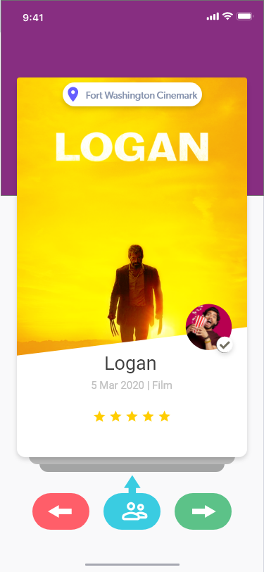

# EventHopper Flutter (EHF)   
#### This Repository Contains All Relevant EventHopper Web & Mobile App Code. 
  This README file contains relevant information for all EHFlutter Developers and will ensure consistency in development practices towards our feature goals while minimizing breakages.
 

## User-Facing Feature Review

The following tables detail feature specifications and corresponding mockups:

Feature Details           |  Mockup
:-------------------------|:-------------------------:
 **Groupchat Feature**   **Lead Dev: [@kylermintah](https://github.com/kylermintah)**  Groupchats are (optionally) created each time   an event is organized. Invited friends are added   to the group. This will assist users with logistics.     **[View Specification](https://github.com/EventHopper/EHFlutter)**   | 
**Event Swipe Feature**   **Lead Dev: [@batchema](https://github.com/batchema)**  Swipe view allows users to swipe through events  in their area based on their likes and preferences.    **Swipe Up:** Invite Friends  **Swipe Left:** Ignore  **Swipe Right:** Add to shortlist  **Swipe Down:** Save for Later     **[View Specification](https://github.com/EventHopper/EHFlutter)**   |   
**Event Map Feature**   **Lead Dev: [@masterford](https://github.com/masterford)**  Swipe view allows the user to view all upcoming  events in a chronological listview and geographically   in a map view.    **[View Specification](https://pub.dev/packages/timeline_list)**  |  

## Partner-Facing Feature Review
Feature Details           |  Mockup
:-------------------------|:-------------------------:
 **Event Creation Feature**   **Lead Dev: [@tbd](https://github.com/EventHopper/EHFlutter)**   Details Pending
 
# For EHF Developers

 
Please see details below pertaining to EventHopper Flutter (EHF) developers to review best practices and approaches for development for EventHopper within the Flutter ecosystem. 

## Releases:

At each development phase we will create a release. **What is a release?** A release is simply a neatly packaged **executable form** of the project. In this case, a release will be comprised of a few files - specifically Andriod APK, iOS IPA and WebApp files. These files will represent the project in it's complete form at a given point in the development phase (i.e. alpha, beta, stable, experimental etc.). Read more about releases in the **Version Branches** section of Workflow Rules below.
