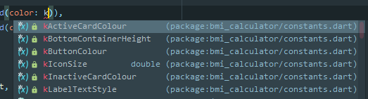

# EventHopper Flutter (EHF) <br> 
#### This Repository Contains All Relevant EventHopper Web & Mobile App Code. 
<br> This README file contains relevant information for all EHFlutter Developers and will ensure consistency in development practices towards our feature goals while minimizing breakages.
<br>

## User-Facing Feature Review

The following tables detail feature specifications and corresponding mockups:

<center>

Feature Details           |  Mockup
:-------------------------|:-------------------------:
 **Groupchat Feature** <br><br>**Lead Dev: [@kylermintah](https://github.com/kylermintah)**<br><br>Groupchats are (optionally) created each time <br> an event is organized. Invited friends are added <br> to the group. This will assist users with logistics. | 
**Event Swipe Feature** <br><br>**Lead Dev: [@batchema](https://github.com/batchema)**<br><br>Swipe view allows users to swipe through events<br/> in their area based on their likes and preferences.<br/> <br/> **Swipe Up:** Invite Friends<br/> **Swipe Left:** Ignore<br/> **Swipe Right:** Add to shortlist<br/> **Swipe Down:** Save for Later|   
**Event Map Feature** <br><br>**Lead Dev: [@masterford](https://github.com/masterford)**<br><br>Swipe view allows the user to view all upcoming<br/> events in a chronological listview and geographically <br> in a map view.<br/> <br/> **[View Specification](https://pub.dev/packages/timeline_list)** <br>|  

</center>

## Partner-Facing Feature Review
Feature Details           |  Mockup
:-------------------------|:-------------------------:
 **Event Creation Feature** <br><br>**Lead Dev: [@tbd](https://github.com/EventHopper/EHFlutter)**<br><br> Details Pending
 
# For EHF Developers

<br>
Please see details below pertaining to EventHopper Flutter (EHF) developers to review best practices and approaches for development for EventHopper within the Flutter ecosystem.<br>

## Releases:


At each development phase we will create a release. **What is a release?** A release is simply a neatly packaged **executable form** of the project. In this case, a release will be comprised of a few files - specifically Andriod APK, iOS IPA and WebApp files. These files will represent the project in it's complete form at a given point in the development phase (i.e. alpha, beta, stable, experimental etc.). Read more about releases in the **Version Branches** section of Workflow Rules below.

## Workflow Rules:

#### **1. Software Release Lifecycle (Version Branches)**: <br>
"Master" sometimes is seen as the branch that is "most official" or up-to-date, however, and from the very beginning, **we will be working on a remote branch per development phase that represents a particular version of the app (i.e. alpha, beta, stable)**. Code review consensus is required for a push to one of the version branches (especially stable - and rigours, automated & manually tested review for stable) as these branches will form the basis of our production code. <br><br>
#### **2. Always Open an Issue for a Feature**: <br>
This is an important one. To track progress and ensure good project structure, an **issue must be created per feature** within the relevant project. <br><br>
#### **3. Always Add a Reviewer Before Merging**: <br>
No code is to be merged into master without review from another developer. A reviewer can be added to a particular commit. **For flutter-related code, add [@kylermintah](https://www.github.com/kylermintah) as a reviewer.**<br><br>
#### **4. Always Work on a Separate Branch per Feature (BPF)**: <br>
Branch Per Feature (BPF) is a commonly used methodology to upkeep Quality Assurance (QA)<br><br>

## Style Notes: <br>
Please review and refer to [Dart Style Guide](https://dart.dev/guides/language/effective-dart/style) for style consistency.
<br>
#### **1. Please utilize Ternary Operators wherever possible.** <br> Example: <br>
```diff
+ color = selectedGender == Gender.MALE ? activeCardColour : inactiveCardColour

- if (selectedGender == Gender.MALE) {
-   color = activeCardColour;
- } else {
-   color = inactiveCardColour;
- }
```

>Ternary Operators are great for widget trees and can simplify code. However, please also note that it is important to ensure good formatting to maintain ternary operator code readability:<br>
<p align="center">

<em><br><a href="https://dev.to/shreyasminocha/what-do-you-think-about-the-ternary-operator-5ajg" target="_blank">comment on ternary operators</a></em>
</p>

#### **2. Don't be afraid to use Functions as 1st Order Objects**
<br> Dart allows you to pass functions as objects which can be very useful for custom widgets. Where there is an opportunity to modularize code, and generify functionality of a widget definitely take it within reason! We would like to keep the code as D.R.Y as possible and reuse of generic widgets can be helpful in this regard.

```diff
+  final Function onPress;
```

#### **3. Respect the lib folder (Package layout conventions)** <br>
The **lib folder** contains all local dart packages/files and it is important that appropriate structure is maintained. This includes the assets folder and its subfolders, the constants.dart file which dictates constants throughout the app etc. The following is an example of appropriate project folder structure for an project called 'enchilada':

```diff
enchilada/
  .dart_tool/ *
  .packages *
  pubspec.yaml
  pubspec.lock **
  LICENSE
  README.md
  CHANGELOG.md
  benchmark/
    make_lunch.dart
  bin/
    enchilada
  doc/
    api/ ***
    getting_started.md
  example/
    main.dart
  lib/
    enchilada.dart
    tortilla.dart
    guacamole.css
    src/
      beans.dart
      queso.dart
  test/
    enchilada_test.dart
    tortilla_test.dart
  tool/
    generate_docs.dart
  web/
    index.html
    main.dart
    style.css
 ```

 <br> Please note, that while asset folders in dart can have any name (as long as the path is specified in the pubspec.yaml file), **we will put all assets inside of a universal assets folder**. Subsequent subdirectories can be named at the discretion of the developer. The reason for the universal subfolder is so that all assets can be dictated in the pubspec.yaml file with the simple path '/assets.' This will keep the pubspec.yaml file as clean and efficient as possible. For more on Package layout conventions see the [dart developer docs](https://dart.dev/tools/pub/package-layout).
 
 #### **4. Constants.dart file** <br>
 constants.dart is a very important file for ensuring uniformity accross the app. Please note there are some brilliant conventions for style utilized in constants.dart that ensure enhanced productivity. For starters, all const variables in constants.dart must begin with a leading 'k' as so:
  ```
import 'package:flutter/material.dart';

const kBottomContainerHeight = 80.0;
const kActiveCardColour = Color(0xFF1d1e33);
const kInactiveCardColour = Color(0xFF111328);
const kButtonColour = Color(0xFFD01247);
const double kIconSize = 80.0;
const kLabelTextStyle = TextStyle(color: Color(0xFF8D8E98), fontSize: 18);

 ```
 
>**Why do this? Because Dart is Smart!** <br>
>Dart looks for instances of the developer typing 'k' when applying a value to an attribute and automatically populates a list of all constants for you to choose from which can save on time and ensure uniformity accross the app.
<p align="center">

<em><br><a href="" target="_blank">constants appear like magic wherever you need them!</a></em>
</p>

>Funny enough this is referred to as variable prefixing and arose from [Hungarian Notation](https://en.wikipedia.org/wiki/Hungarian_notation). It seems to be [frowned upon in the Dart developer docs](https://dart.dev/guides/language/effective-dart/style#dont-use-prefix-letters), but let's do it anyway because it's really convinient.
