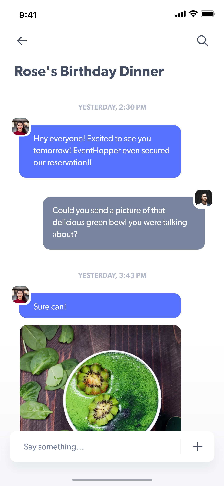
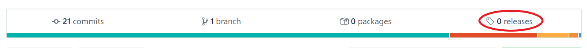
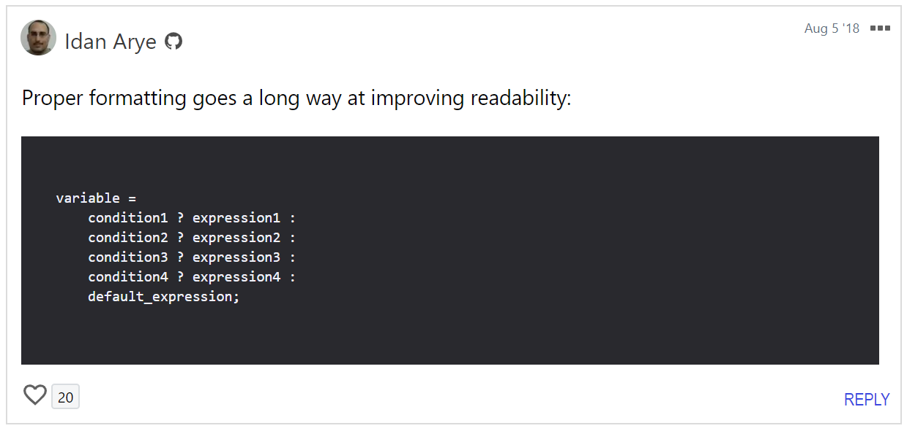

# EHFlutter <br> 
### EventHopper Flutter
##### This Repository Contains All Relevant EventHopper Web & Mobile App Code. This README file contains relevant information for all EHFlutter Developers and will ensure consistency in development practices to minimize breakages.
<br>

## Feature Review

The following tables detail feature specifications and corresponding mockups:

<center>

Messaging Feature             |  Mockup
:-------------------------:|:-------------------------:
Groupchats are created each <br/> time an event is organized |  

</center>

# For EHFlutter Developers

<br>

## Releases:



At each development phase we will create a release. What is a release? A release is simply a neatly packaged **executable form** of the project. In this case, a release will be comprised of a few files - specifically Andriod APK, iOS IPA and WebApp files. These files will represent the project in it's complete form at a given point in the development phase (i.e. alpha, beta, stable, experimental etc.). Read more about releases in the **Version Branches** section of Workflow Rules below.

## Workflow Rules:

**1. Version Branches**: <br>
"Master" sometimes is seen as the branch that is "most official" or up-to-date, however, and from the very beginning, **we will be working on a remote branch per development phase that represent a particular version of the app (i.e. alpha, beta, stable)**. Group consensus is required for a push to one of the version branches as eventually these branches <br><br>
**2. Always Open an Issue for a Feature**: <br>
This is an important one. To track progress and ensure good project structure, an **issue must be created per feature** within the relevant project. <br><br>
**3. Always Add a Reviewer Before Merging**: <br>
No code is to be merged into master without review from another developer. A reviewer can be added to a particular commit. **For flutter-related code, add @kylermintah as a reviewer.**<br><br>
**4. Always Work on a Separate Branch per Feature (BPF)**: <br>
Branch Per Feature (BPF) is a commonly used methodology to upkeep Quality Assurance (QA)<br><br>

## Style Notes for EHFlutter Developers: <br>
Please review and refer to [Dart Style Guide](https://dart.dev/guides/language/effective-dart/style) for style consistency.
<br>
**1. Please utilize Ternary Operators wherever possible.** <br> Example: <br>
```diff
+ color = selectedGender == Gender.MALE ? activeCardColour : inactiveCardColour

- if (selectedGender == Gender.MALE) {
-   color = activeCardColour;
- } else {
-   color = inactiveCardColour;
- }
```

>Ternary Operators are great for widget trees and can simplify code. However, please also note that it is important to ensure good formatting to maintain ternary operator code readability:<br>
<p align="center">

<em><br><a href="https://dev.to/shreyasminocha/what-do-you-think-about-the-ternary-operator-5ajg" target="_blank">comment on ternary operators</a></em>
</p>
